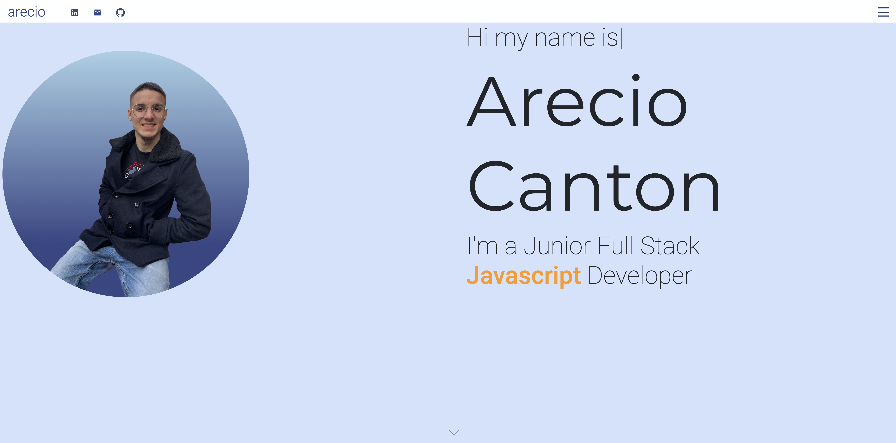
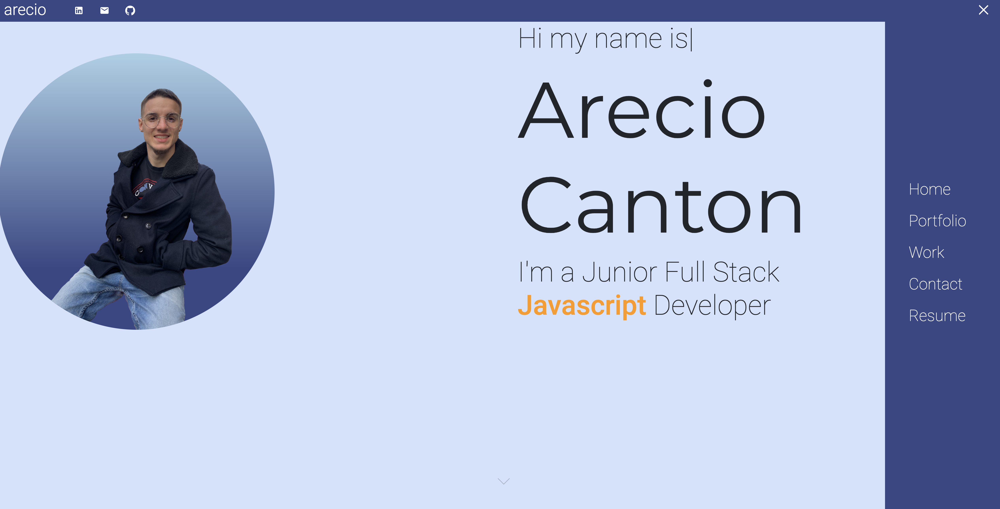
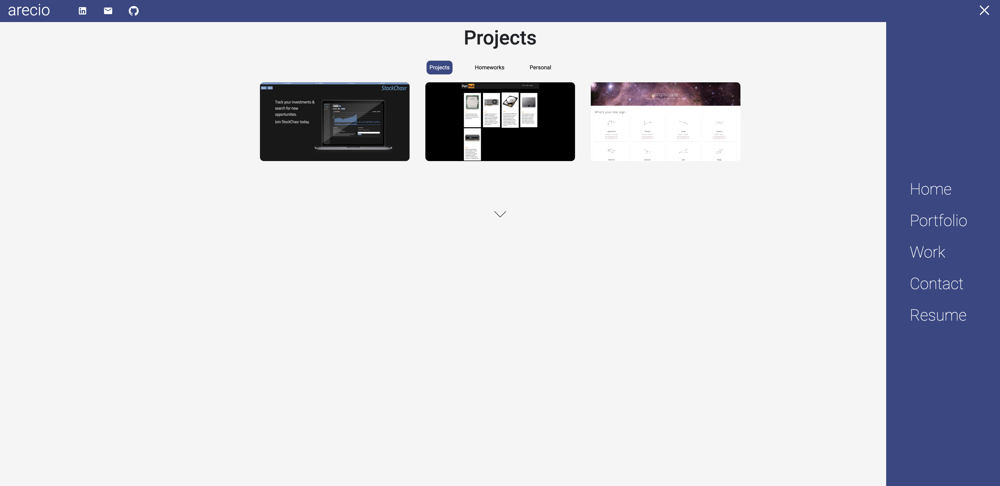
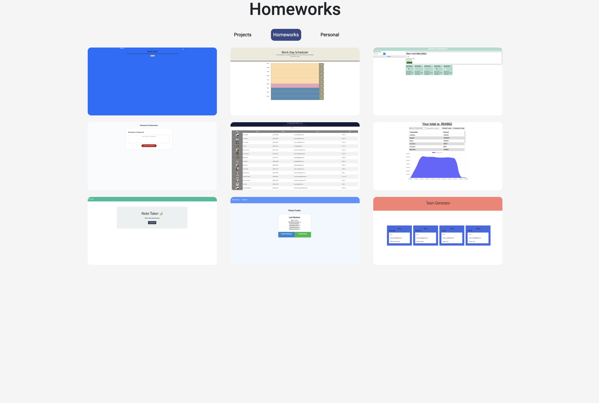
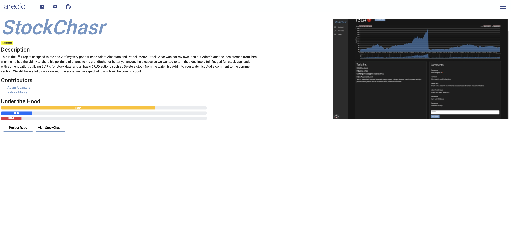
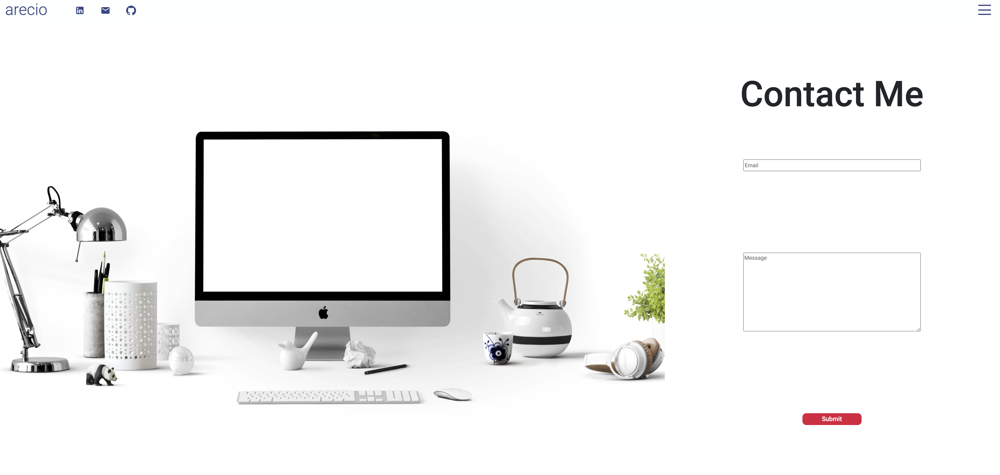

# Arecios React Portfolio
  

  # Live Site
  [Link](https://arecio3.github.io/updated-react-portfolio/)
  # Pictures
  </img>
  </img>
  </img>
  </img>
  </img>
  </img>

  # Table of Contents 
  * [Installation](#Installation) 
  * [Usage](#Usage) 
  * [License](#license)
  * [Contributing](#Contribute) 
  * [Testing](#Testing)
  * [Questions](#Questions)
  
  # Description 
This is my updated react portfolio that holds all of my projects I plan to continue working on the media queries.
  
  # Installation
   **npm i**

  # Testing
  **npm test**

  # Contribute
  **Create pull request**

  # Usage
  **git clone**

  # Questions
  If you had any questions feel free to contact my email cuba289@gmail.com

  To see more of my work visit me here [Arecio3](https://github.com/Arecio3)

  # License
  

